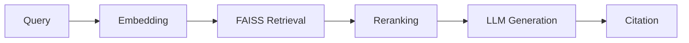

AI demos are everywhere. Production AI agents are not. The gap between a ChatGPT wrapper and a system that handles thousands of enterprise queries daily — with reliability, cost control, and sub-second latency — is enormous.

Over the past year at TransUnion, I've been leading the **Insights AI Agent Team**, building agents that operate on proprietary financial data at scale. This post shares the architectural patterns, tooling decisions, and hard-won lessons from that journey.

## Why Enterprise AI Agents Are Different

Most AI agent tutorials show a single LLM call with a tool. Enterprise agents face a fundamentally different reality:

- **Reliability requirements**: A hallucinated SQL query against a production database isn't a fun demo bug — it's a compliance incident.
- **Cost at scale**: GPT-4 at $30/1M output tokens across thousands of daily queries adds up. You need tiered model strategies.
- **Latency budgets**: Dashboards need answers in seconds, not the 30+ seconds a naive agent chain takes.
- **Data sensitivity**: Financial data can't leave your VPC. Self-hosted models and careful prompt design are non-negotiable.

These constraints shaped every architectural decision we made.

## The Agent Architecture: LangGraph Supervisor Pattern

We use [LangGraph](https://langchain-ai.github.io/langgraph/) — LangChain's graph-based orchestration framework — to build a **supervisor-routed multi-agent system**. Here's the high-level structure:

```mermaid
flowchart TD
  supervisor["Supervisor Agent<br/>(intent classification + routing)"]

  nlpSql["NLP-to-SQL Agent"]
  rag["RAG Q&A Agent"]
  graph["Knowledge Graph Agent"]
  anomaly["Anomaly Detector Agent"]

  supervisor --> nlpSql
  supervisor --> rag
  supervisor --> graph
  supervisor --> anomaly
```

### Why a supervisor, not a single monolithic agent?

**Separation of concerns.** Each agent is a specialist:

- **NLP-to-SQL Agent**: Translates natural language questions into SQL queries against our data warehouse. Uses schema-aware prompting and query validation before execution.
- **RAG Q&A Agent**: Retrieval-augmented generation over internal documentation and research reports. Uses FAISS for vector search with chunk-level citation tracking.
- **Knowledge Graph Agent**: Builds and queries Neo4j graphs for entity relationship exploration — "Show me all companies connected to X through Y."
- **Anomaly Detection Agent**: Identifies missing patterns and statistical outliers in time-series financial data.
- **Dashboard Generation Agent**: Produces Apache Superset dashboard configurations from natural language requests.

The supervisor classifies intent in a single cheap LLM call, then routes to the appropriate specialist. This keeps each agent's prompt focused and its tool set minimal — both critical for reliability.

### Graph State and Conditional Routing

LangGraph gives us **stateful, conditional execution graphs** — far more control than a simple chain:

```python
from langgraph.graph import StateGraph, END

workflow = StateGraph(AgentState)

# Add nodes (each is an agent or processing step)
workflow.add_node("supervisor", supervisor_node)
workflow.add_node("nlp_to_sql", nlp_sql_agent)
workflow.add_node("rag_qa", rag_agent)
workflow.add_node("knowledge_graph", kg_agent)
workflow.add_node("anomaly_detector", anomaly_agent)

# Conditional routing from supervisor
workflow.add_conditional_edges(
    "supervisor",
    route_by_intent,
    {
        "sql_query": "nlp_to_sql",
        "document_qa": "rag_qa",
        "entity_search": "knowledge_graph",
        "anomaly_check": "anomaly_detector",
        "done": END,
    },
)
```

The key insight: **the graph is the architecture**. Adding a new agent type means adding a node and a routing condition — not rewriting the entire system.

## NLP-to-SQL: The Hardest "Simple" Problem

Translating natural language to SQL sounds straightforward until you try it against a schema with 200+ tables and proprietary column names like `cr_scr_v2_adj`.

### What works

1. **Schema-aware prompting**: We inject only the relevant table schemas (not the entire warehouse) based on the user's question. A lightweight classifier picks the top 3–5 relevant tables.
2. **Query validation layer**: Before execution, generated SQL is parsed and validated — checking for valid table/column references, preventing dangerous operations (DROP, DELETE), and enforcing row limits.
3. **Few-shot examples per domain**: Instead of generic SQL examples, we maintain domain-specific few-shot banks. "What's the default rate for segment X?" maps to very different SQL than "Compare revenue across quarters."
4. **Iterative correction**: If a query fails, the error message is fed back to the LLM for self-correction — but with a maximum retry count to prevent infinite loops.

### What doesn't work

- **Dumping the entire schema into the prompt**: Context window pollution. The model gets confused by irrelevant tables.
- **Zero-shot SQL generation for complex joins**: Multi-table joins with proprietary naming require examples. Period.
- **Trusting the output without validation**: Always validate. Always.

## RAG at Enterprise Scale

Our RAG pipeline handles internal research reports, compliance documents, and analyst notes. The architecture:



### Key decisions

- **Chunk size matters enormously.** We settled on ~500 tokens with 50-token overlap after testing showed that smaller chunks improved retrieval precision for specific questions, while larger chunks helped with context-heavy answers. There's no universal right answer — test on your data.
- **Reranking is non-negotiable.** FAISS retrieval alone gives you the top-K similar chunks, but similarity ≠ relevance. A lightweight cross-encoder reranker (running locally) dramatically improved answer quality.
- **Citation tracking builds trust.** Every generated answer includes references to the specific document chunks used. Enterprise users won't trust an AI that can't show its sources.

## LLMOps with MLFlow

Deploying an agent is the easy part. Keeping it reliable in production is where MLFlow becomes essential:

- **Experiment tracking**: Every prompt template change, model swap, or parameter tweak is logged as an experiment. We can compare accuracy, latency, and cost across configurations.
- **Model registry**: Production-promoted models are versioned and tagged. Rolling back a bad deployment is a one-line operation.
- **Monitoring**: We track token usage, latency percentiles, error rates, and user satisfaction signals. Drift detection alerts us when answer quality degrades — usually because the underlying data schema changed.

The pattern: **treat your prompts like code and your models like deployments.** Version everything. Test everything. Monitor everything.

## Tools That Accelerate Development

Beyond the core stack, these tools have meaningfully accelerated our development velocity:

- **Claude Code** (with subagents and hooks): For scaffolding new agent types, writing test fixtures, and exploring unfamiliar APIs. The subagent pattern — delegating research to one agent while implementation continues in another — maps surprisingly well to how I think about agent development itself.
- **Cursor AI**: For rapid prototyping and refactoring. The codebase-aware suggestions significantly reduce boilerplate.
- **LangSmith**: LangChain's tracing tool. Invaluable for debugging multi-step agent runs where you need to see exactly which tool was called with which arguments and what the LLM's reasoning was at each step.

## Key Takeaways

1. **Start with the supervisor pattern.** Even if you only have one agent type today, the routing infrastructure pays for itself when you add the second.
2. **Validate everything the LLM generates.** SQL, API calls, graph queries — never execute without validation.
3. **Invest in observability early.** You can't improve what you can't measure. MLFlow + LangSmith give you the instrumentation you need.
4. **Optimize for cost, not just quality.** Use cheap models for classification and routing; reserve expensive models for generation. A tiered approach can cut costs 60–80% without meaningful quality loss.
5. **Domain-specific few-shot examples outperform generic prompting.** Every. Single. Time.

## What's Next

We're actively exploring:

- **Agentic workflows with human-in-the-loop**: For high-stakes decisions, routing to a human reviewer before execution.
- **Fine-tuned smaller models**: Replacing GPT-4 calls with domain-fine-tuned 7B models for specific, well-defined tasks.
- **Multi-modal agents**: Incorporating chart and image understanding for richer analysis.

If you're building production AI agents and want to compare notes, I'd love to connect — reach out via the [contact page](/contact) or find me on [LinkedIn](https://linkedin.com/in/ayush-jaipuriar).
